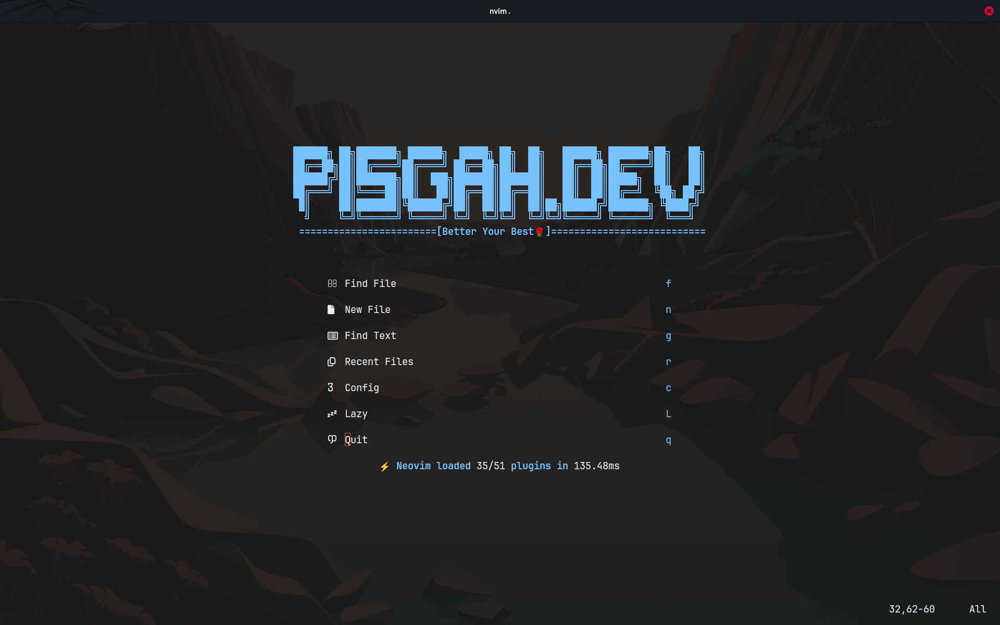
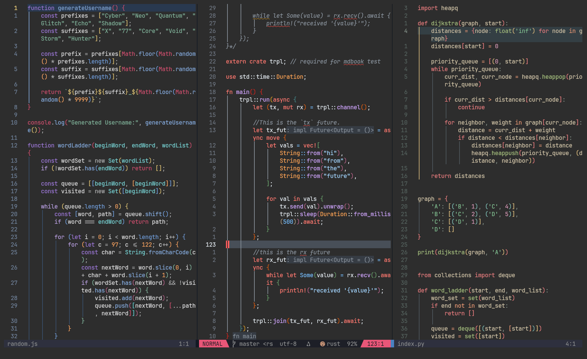

# What is NeoVim?

Neovim is a fast, efficient, and highly customizable text editor designed for coders. It builds on the strengths of Vim while introducing powerful features like plugin support, an embedded Lua engine, and async execution to supercharge your workflow.

If you've ever used a bulky IDE and wished for something faster, lighter, and tailored to your exact needs, Neovim is your playground. Whether you're editing code, writing docs, or customizing your dev setup down to the pixel, Neovim gives you full control — all from your terminal.




I do not deserve to take all the credit. This was a clone and modification of the nvim setup by [Arfan Zubi](https://github.com/3rfaan), [Arfan Zubi YT](https://youtube.com/@zubiarfan?si=03t-IIL6_Ows-gWB).

This setup has been customized for users of Rust, HTML, CSS, Bash, Lua.

It is loaded with a tonne of feature including: auto completion features, LSP support, beautiful UI among other features.

# Requirements:

- NVIM v0.11.0
- Use a Nerd Font. I use [JetBrains Mono](https://www.jetbrains.com/lp/mono/#).
- Install `imagemagick` to work well with [image.nvim](https://github.com/3rd/image.nvim) plugin.
- Install `tokei` ensure language detection menu displays well.(todo!)

```bash
apt install imagemagick tokei
```

- You need to have the excalidraw app installed as a [Progressive Web App (PWA)](https://en.wikipedia.org/wiki/Progressive_web_app) and configured as default application for .excalidraw files. The plugin provides a custom opener that tries to find the file in the link, even if you configure it to use relative paths.

> Open [Excalidraw.com](https://excalidraw.com) using your Chromium-based web browser(Brave, Chrome, Edge).
>
> Click the three dots in top right in browser's menu > **Install Excalidraw** > Set the default app for the .excalidraw files (Right click > Open With > Excalidraw)
>
> Once you use the excalidraw command, I have set it to store the `.excalidraw` files in `<working_dir>/.bulb/excalidraw/` for better organization of the codebase instead of the default `~/.excalidraw/` dir.
> <br> You can check it out in `.config/nvim/lua/plugins/extras.lua` .

# Features May2k25.

- File Explorer on the right.
  It is a better option because it gives me adequate space to work on my code, besides no one really writes code that fills up the right spaces, so why not use it🤷.
- Uses the "_[Github Dark theme](https://github.com/projekt0n/github-nvim-theme)_" colour-scheme with a transparent background. This feature is also useful if the terminal that is being used is also set to have a transparent background.

  _Github Dark_ just looks so beautiful 🤩 in my opinion, especially for Rust, C and C++ code.

  Multiple other colour-schemes come included: [catppuccin](https://github.com/catppuccin/nvim), [molokai](https://github.com/UtkarshVerma/molokai.nvim), [horizon](https://github.com/akinsho/horizon.nvim), [darcula solid](https://github.com/santos-gabriel-dario/darcula-solid.nvim)

- Auto Completion using [nvim-cmp](https://github.com/hrsh7th/nvim-cmp) which has been set for configuration for Rust, Python, Solana languages.
- Excellent LSP support.
- Dense Plugin system.
- Customizable and key bindings.
- Uses [snacks.nvim](https://github.com/folke/snacks.nvim) for additional functionality with minimal plugin configuration.
- Phenomenal status bar.
- Git signs to visualise the changes in your code.
- Language dependent colour-scheme.

---

# How to install

## 1. Linux & Mac Users 🐧 & 🍏

It installs all the required tools and plugins that will get you up and running in no time.
<br>No matter the distro, go to your terminal and type:

```bash
cd ~/.config && git clone https://github.com/pisgahk/nvim.git  && cd nvim && nvim .
```

Remove the `.git` file

```bash
rm -rf .git
```

## 2. Windows users 🪟

<details>
    <summary> a. Vanilla Windows (Unstable, Not well tested, not recommended) </summary>
    Some features do not work in this version of Windows, install WSL for the full experience.

Pre-requisities:

1. Install `ripgrep`.

```bash
choco install ripgrep
```

2. Have a [Nerd-Font](https://www.nerdfonts.com/font-downloads) installed preferably [JetBrains Mono Nerd font](https://github.com/ryanoasis/nerd-fonts/releases/download/v3.4.0/JetBrainsMono.zip), or [FiraCode Nerd font](https://github.com/ryanoasis/nerd-fonts/releases/download/v3.4.0/FiraCode.zip).

Open `Terminal` or `Command Prompt` and paste this command.

```bash
git clone https://github.com/pisgahk/nvim.git %USERPROFILE%\AppData\Local\nvim && nvim
```

</details>

### b. In WSL(Highly Recommended)

```bash
git clone https://github.com/pisgahk/nvim.git ~/.config/nvim  && cd .config/nvim && nvim .
```

---
There is this new tool called gitlogue, i want to see what it does and how it carries out its functionality, it seems too good to be true, hence lemme give it a shot.

The most trusted git repo that i have is this nvim config, hence there is no other way that I can test it except from using the files in this config.
The thing is I want to be the best dev that I can be, hence I acknowledge the work of other devs in this field.
This journey begun on 08.04.2025, let us see how far we will go.
