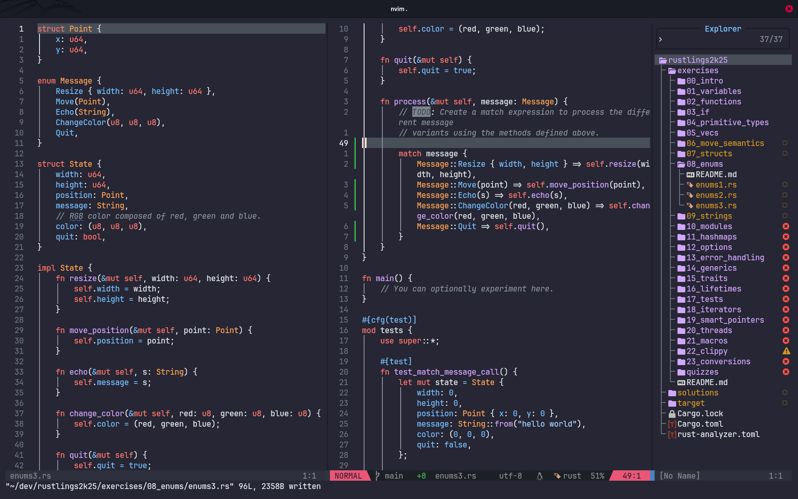

# What is this?




This is the new configuration of NeoVim for power users of Rust, Python, Solana(Even though I have not yet configured Solana settings yet as per May2025).

It is loaded with auto completion features, lsp support, beautiful UI ...

#  Features May2k25.
- File Explorer on the right.
  It is a better option because it gives me adequate space to work on my code, besides no one really writes code that fills up the right spaces, so why not use it🤷.
- Uses the "*Github Dark theme*" colour-scheme with a transparent background. This feature is also useful if the terminal that is being used is also set to have a transparent background.
  
  *Github Dark* just looks so beautiful 🤩 in my opinion, especially for Rust, C and C++ code.
  
  Multiple other colour-schemes come included:
  - [catpuccin](https://github.com/catppuccin/nvim)
  - [molokai](https://github.com/UtkarshVerma/molokai.nvim)
  - [horizon](https://github.com/akinsho/horizon.nvim)
    
- Auto Completion using [nvim-cmp](https://github.com/hrsh7th/nvim-cmp) which has been set for configuration for Rust, Python, Solana languages.
- Excellent LSP support.
- Dense Plugin system.
- Customizable and key bindings.
- Uses [snack.nvim](https://github.com/folke/snacks.nvim) for additional functionality with minimal plugin configuration.
- Phenomenal status bar.
- Git signs to visualise the changes in your code.
 
---

# How to install
## 1. Linux Users 🐧
No matter the distro, go to your terminal and type:
```bash
cd ~/.config && https://github.com/pisgahk/nvim.git && cd nvim && nvim .
```

It installs all the required tools and plugins that will get you up and running in no time. 
## 2. Windows users 🪟
(As per now I have no idea) though i recommend that you install WSL and then continue from there.
I found these sources extremely helpful(esp the first):
- [Andres Vidoza on YT](https://www.youtube.com/watch?v=mfemGt0syqo&t=274s)
- [medium.com](https://medium.com/@liu-qilong/a-complete-guide-to-setup-wsl-windows-subsystem-for-linux-4547e88b6cdb)
## 2. Mac users 🍏
(Never used mac ever, though i think that it is the same procedure. Just `git clone` the repo in your `.config` file.)

