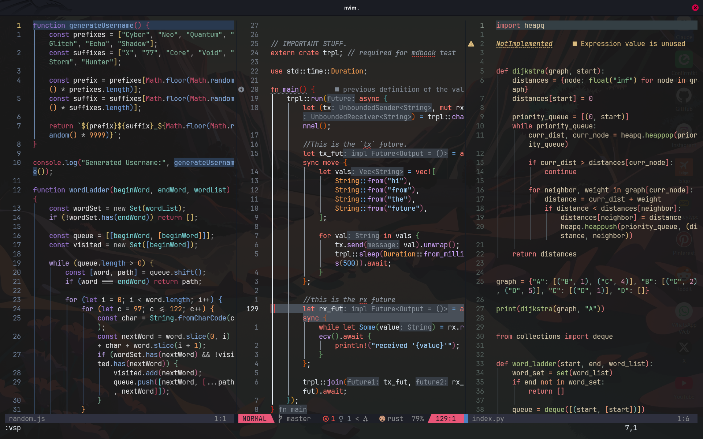

# What is NeoVim?

Neovim is a fast, efficient, and highly customizable text editor designed for coders. It builds on the strengths of Vim while introducing powerful features like plugin support, an embedded Lua engine, and async execution to supercharge your workflow.

If you've ever used a bulky IDE and wished for something faster, lighter, and tailored to your exact needs, Neovim is your playground. Whether you're editing code, writing docs, or customizing your dev setup down to the pixel, Neovim gives you full control — all from your terminal.




I do not deserve to take all the credit. This was a clone and modification of the nvim setup by [Arfan Zubi](https://github.com/3rfaan), [Arfan Zubi YT](https://youtube.com/@zubiarfan?si=03t-IIL6_Ows-gWB).

This setup has been customised for users of Rust, Python, Golang, HTML, CSS, JS, TS, Bash, Lua among others.

It is loaded with a tonne of feature including: auto completion features, LSP support, beautiful UI ...

# Requirements:

- NVIM v0.11.0
- Use a Nerd Font. I use [JetBrains Mono](https://www.jetbrains.com/lp/mono/#).
- Install `imagemagick` to work well with [image.nvim](https://github.com/3rd/image.nvim) plugin.

```bash
apt install imagemagick
```

# Features May2k25.

- File Explorer on the right.
  It is a better option because it gives me adequate space to work on my code, besides no one really writes code that fills up the right spaces, so why not use it🤷.
- Uses the "_[Github Dark theme](https://github.com/projekt0n/github-nvim-theme)_" colour-scheme with a transparent background. This feature is also useful if the terminal that is being used is also set to have a transparent background.

  _Github Dark_ just looks so beautiful 🤩 in my opinion, especially for Rust, C and C++ code.

  Multiple other colour-schemes come included:
  - [catppuccin](https://github.com/catppuccin/nvim)
  - [molokai](https://github.com/UtkarshVerma/molokai.nvim)
  - [horizon](https://github.com/akinsho/horizon.nvim)
  - [darcula solid](https://github.com/santos-gabriel-dario/darcula-solid.nvim)

- Auto Completion using [nvim-cmp](https://github.com/hrsh7th/nvim-cmp) which has been set for configuration for Rust, Python, Solana languages.
- Excellent LSP support.
- Dense Plugin system.
- Customizable and key bindings.
- Uses [snacks.nvim](https://github.com/folke/snacks.nvim) for additional functionality with minimal plugin configuration.
- Phenomenal status bar.
- Git signs to visualise the changes in your code.
- Language dependent colour-scheme.

---

# How to install

## 1. Linux & Mac Users 🐧 & 🍏

No matter the distro, go to your terminal and type:

```bash
cd ~/.config && git clone https://github.com/pisgahk/nvim.git && rm -rf .git && cd nvim && nvim .
```

It installs all the required tools and plugins that will get you up and running in no time.

## 2. Windows users 🪟

### a. Vanilla Windows.

Some features do not work in this version of Windows, install WSL for the full experience.

Pre-requisities:

1. Install `ripgrep`.

```bash
choco install ripgrep
```

2. Have a [Nerd-Font](https://www.nerdfonts.com/font-downloads) installed preferably [JetBrains Mono Nerd font](https://github.com/ryanoasis/nerd-fonts/releases/download/v3.4.0/JetBrainsMono.zip), or [FiraCode Nerd font](https://github.com/ryanoasis/nerd-fonts/releases/download/v3.4.0/FiraCode.zip).

Open `Terminal` or `Command Prompt` and paste this command.

```bash
git clone https://github.com/pisgahk/nvim.git %USERPROFILE%\AppData\Local\nvim && nvim
```

### b. In WSL(Highly Recommended)

```bash
git clone https://github.com/pisgahk/nvim.git ~/.config/nvim && rm -rf ~/.config/nvim/.git && nvim ~/.config/nvim
```

---

This journey begun on 08.04.2025, let us see how far we will go.
